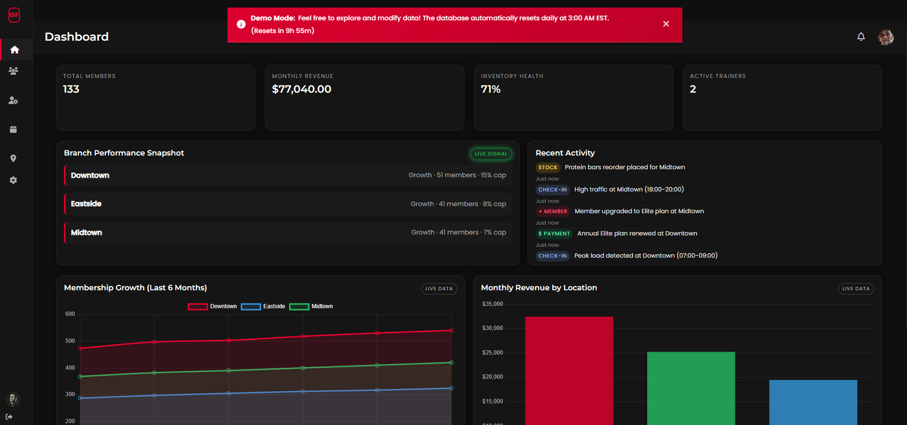
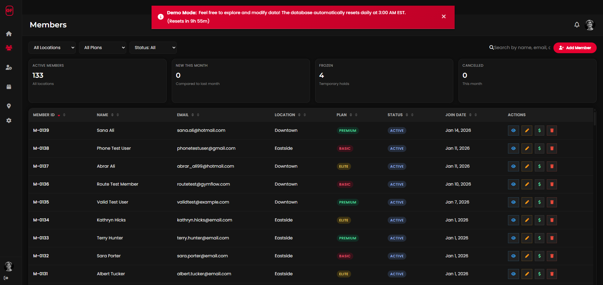
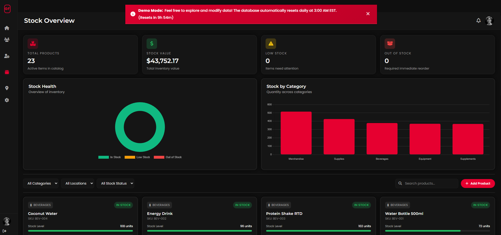

# GymFlow - Gym Management System

A comprehensive full-stack web application for managing gym operations including member management, staff scheduling, inventory tracking, and 
multi-location analytics with automated demo resets.

**[Live Demo] (https://gymflow-management-system-production.up.railway.app/admin/dashboard.html)**

> **Demo Mode:** Data automatically resets daily at 3:00 AM EST. Feel free to explore all features without limitations!

---

## Screenshots

### Dashboard Overview

*Real-time KPIs, membership trends, and branch performance analytics*

### Member Management

*Complete member lifecycle tracking with advanced search and filtering*

### Inventory System

*Multi-location inventory tracking with automated reorder management*

---

## Key Features

### **Member Management**
- Complete CRUD operations for member records
- Multi-location membership support (Downtown, Midtown, Eastside)
- Member status tracking (Active, Frozen, Expired)
- Payment history and plan management (Basic, Premium, Elite)
- Real-time check-in system with timestamp tracking
- Member search and filtering by location, plan, and status

### **Analytics Dashboard**
- Real-time KPI cards (Total Members, Monthly Revenue, Inventory Health)
- Interactive Chart.js visualizations for membership growth
- Branch performance comparison with utilization metrics
- Live activity feed with real-time updates
- Revenue tracking by location

### **Staff Management**
- Staff member CRUD with role assignment
- Shift scheduling with overlap detection
- Role-based organization (Manager, Trainer, Front Desk CSR, Operations)
- Trainer specialization tracking (Strength, Cardio, Yoga, CrossFit, etc)
- Contact and emergency contact management

### **Inventory Control**
- Multi-location product tracking across all branches
- Automated low-stock alerts based on reorder points
- Reorder request management (Pending, Approved, Received, Rejected)
- Vendor management with complete contact information
- Category-based product organization (Beverages, Equipment, Merchandise, Supplements, Supplies)
- Stock level monitoring and adjustment tracking

### **Location Management**
- Support for multiple gym branches
- Capacity tracking with utilization percentages
- Capacity warnings when approaching limits
- Cannot reduce capacity below current active member count (business logic validation)

### **System Settings**
- Customizable currency symbols
- Date format preferences
- Low inventory alert thresholds
- Capacity warning level configuration

### **Security Features**
- **Input Validation:** 23 validators covering all API endpoints
- **Rate Limiting:** 4-tier system preventing DoS attacks
    - General API: 1000 requests per 15 minutes
    - Check-ins: 500 requests per 15 minutes
    - Payments: 100 requests per hour
    - Auth: 20 attempts per 15 minutes
- **SQL Injection Prevention:** Parameterized queries throughout
- **XSS Protection:** Input sanitization on all user inputs
- **Business Logic Validation:** Prevents impossible states (.e.g., capacity < active members)

### **Demo Mode**
- Automated database reset daily at 3:00 AM EST via node-cron
- Persistent demo banner with live countdown timer
- Session-based banner dismissal
- Manual reset endpoint for testing: `POST /api/admin/reset-database'
- 195 SQL statements execute with zero errors on reset

---

## Tech Stack

### **Frontend**
- **HTML5/CSS3** - Semantic markup with modern CSS Grid/Flexbox
- **Vanilla JavaScript (ES6+)** - No frameworks, pure browser APIs
- **Chart.js** - Interactive line and bar charts
- **Font Awesome** - Professional Icon library

### **Backend**
- **Node.js (v18+)** - JavaScript runtime environment
- **Express 5** - Web application framework
- **MySQL2** - Database driver with connection pooling
- **express-validator** - Server-side input validation
- **express-rate-limit** - API rate limiting middleware
- **node-cron** - Automated task scheduling
- **bcrypt** - Password hashing for future authentication
- **dotenv** - Environment variable management
- **CORS** - Cross-origin resource sharing

### **Database**
- **MySQL 8.4** - Relational database
- **16 tables** with proper foreign key relationships
- **Connection pooling** for performance optimization

### **Deployment & DevOps**
- **Railway** - Cloud hosting platform with auto-deployment
- **Git/GitHub** - Version control with CI/CD
- **Environment-based configs** - Development vs Production settings

---

## Project Architecture

GymFlow/
├── admin/                     # Frontend HTML pages
│   ├── dashboard.html         # Analytics dashboard
│   ├── members.html           # Member management
│   ├── staff.html             # Staff management
│   ├── inventory.html         # Product inventory
│   ├── inventory-reorders.html # Reorder management
│   ├── inventory-vendors.html  # Vendor management
│   ├── locations.html         # Location management
│   └── settings.html          # System settings
│
├── backend/
│   ├── config/
│   │   └── database.js        # MySQL connection pool
│   ├── middleware/
│   │   ├── validation.js      # 23 express-validator rules
│   │   └── rateLimiter.js     # 4-tier rate limiting
│   ├── routes/
│   │   ├── members.js         # Member API endpoints
│   │   ├── staff.js           # Staff API endpoints
│   │   ├── inventory.js       # Inventory API endpoints
│   │   ├── locations.js       # Location API endpoints
│   │   ├── settings.js        # Settings API endpoints
│   │   ├── dashboard.js       # Dashboard analytics API
│   │   └── shifts.js          # Shift scheduling API
│   ├── utils/
│   │   └── resetDatabase.js   # Auto-reset utility
│   ├── database/
│   │   └── seed.sql           # Database seed (195 statements)
│   ├── package.json
│   └── server.js              # Express app entry point
│
├── css/
│   ├── base.css               # Global styles & variables
│   ├── layout.css             # Sidebar, topbar, containers
│   ├── components/
│   │   ├── cards.css          # Card components
│   │   ├── forms.css          # Form styling
│   │   ├── modals.css         # Modal system
│   │   └── tables.css         # Table styling
│   └── pages/                 # Page-specific styles
│
├── js/
│   ├── main.js                # Global utilities & banner logic
│   ├── sidebar.js             # Navigation logic
│   ├── modals.js              # Modal system
│   ├── shared.js              # Shared helper functions
│   └── pages/                 # Page-specific JavaScript
│       ├── admin-dashboard.js
│       ├── members.js
│       ├── staff.js
│       └── inventory.js
│
├── package.json               # Root package for Railway
├── .gitignore
└── README.md

## Local Development Setup

### **Prerequisites**
- Node.js v18 or higher
- MySQL 8.0 or higher
- Git

### **Installation Steps**

1. **Clone the repository**
```bash
git clone https://github.com/AmaanAli1/GymFlow.git
cd GymFlow
```

2. **Install backend dependencies**
```bash
cd backend
npm install
```

3. **Configure environment variables**

Create `backend/.env`:
```env
DB_HOST=localhost
DB_USER=root
DB_PASSWORD=your_mysql_password
DB_NAME=gymflow
DB_PORT=3306
PORT=5000
NODE_ENV=development
```

4. **Set up the database**

**Option A: MySQL Workbench**
- Server → Data Import → Import from Self-Contained File
- Select `backend/database/seed.sql`
- Create new schema named `gymflow`
- Start Import

**Option B: Command Line**
```bash
mysql -u root -p
CREATE DATABASE gymflow;
USE gymflow;
SOURCE backend/database/seed.sql;
```

5. **Start the development server**
```bash
cd backend
npm start
```

6. **Access the application**
```
http://localhost:5000/admin/dashboard.html
```

---

## API Documentation

### **Base URL**
```
Development: http://localhost:5000/api
Production: https://gymflow-management-system-production.up.railway.app/api
```

### **Members Endpoints**

| Method | Endpoint | Description |
|--------|----------|-------------|
| GET | `/api/members` | Get all members (supports filters) |
| GET | `/api/members/:id` | Get member by ID |
| POST | `/api/members` | Create new member |
| PUT | `/api/members/:id` | Update member details |
| DELETE | `/api/members/:id` | Delete member |
| POST | `/api/members/:id/check-in` | Record member check-in |
| POST | `/api/members/:id/freeze` | Freeze membership |
| POST | `/api/members/:id/unfreeze` | Unfreeze membership |
| POST | `/api/members/:id/reactivate` | Reactivate expired membership |

### **Staff Endpoints**

| Method | Endpoint | Description |
|--------|----------|-------------|
| GET | `/api/staff` | Get all staff members |
| POST | `/api/staff` | Add new staff member |
| PUT | `/api/staff/:id` | Update staff member |
| DELETE | `/api/staff/:id` | Remove staff member |
| POST | `/api/staff/trainers` | Add trainer specialization |

### **Inventory Endpoints**

| Method | Endpoint | Description |
|--------|----------|-------------|
| GET | `/api/inventory/products` | Get all products |
| POST | `/api/inventory/products` | Add new product |
| PUT | `/api/inventory/products/:id` | Update product |
| DELETE | `/api/inventory/products/:id` | Delete product |
| GET | `/api/inventory/reorders` | Get reorder requests |
| POST | `/api/inventory/reorders` | Create reorder request |
| PUT | `/api/inventory/reorders/:id/receive` | Mark reorder as received |
| PUT | `/api/inventory/reorders/:id/reject` | Reject reorder request |

### **Dashboard Endpoint**

| Method | Endpoint | Description |
|--------|----------|-------------|
| GET | `/api/dashboard` | Get dashboard analytics (KPIs, charts, alerts) |

### **Admin Endpoints**

| Method | Endpoint | Description |
|--------|----------|-------------|
| POST | `/api/admin/reset-database` | Manually trigger database reset |

---

## Security Implementation

### **Input Validation (23 Validators)**

**Members (8 validators):**
- Name: 2-100 chars, letters/spaces/hyphens only
- Email: Valid format, normalized, duplicate check
- Phone: (555) 123-4567 format required
- Plan: Whitelisted (Basic, Premium, Elite)
- Emergency Contact: Validated phone format

**Staff (3 validators):**
- Role: Whitelisted (Manager, Trainer, Front Desk CSR, Operations)
- Email uniqueness check (async DB query)
- Hire date validation (cannot be future date)

**Inventory (6 validators):**
- Product names: 2-100 chars, duplicate check
- Category: Whitelisted validation
- Prices: $0.01 - $100,000 range
- Reorder quantities: 1-10,000 units
- Vendor information: Canadian postal codes, email format

**Locations (1 validator):**
- Capacity: Must be ≥ current active members (business logic)

**Settings (1 validator):**
- Currency/Date format: Whitelisted values only

### **Rate Limiting Configuration**
```javascript
// General API Protection
apiLimiter: 1000 requests per 15 minutes

// Check-in Endpoint
checkInLimiter: 500 requests per 15 minutes

// Payment Endpoint (future)
paymentLimiter: 100 requests per hour

// Authentication (future)
authLimiter: 20 attempts per 15 minutes
```

### **SQL Injection Prevention**
- All queries use parameterized statements (`?` placeholders)
- Zero string concatenation in SQL
- Input sanitization via express-validator

---

## Database Schema

**16 Tables:**

- **members** - Member information, status, plan details
- **staff** - Staff details, roles, contact info
- **locations** - Gym branches with capacity tracking
- **shifts** - Staff scheduling with overlap detection
- **check_ins** - Member check-in history with timestamps
- **payments** - Payment records and history
- **products** - Inventory items with pricing
- **inventory** - Stock levels per location
- **vendors** - Supplier contact information
- **reorder_requests** - Inventory reorder workflow
- **system_settings** - Application-wide configuration
- **admins** - Admin accounts (future authentication)
- **revenue** - Revenue tracking
- **payment_methods** - Payment type definitions
- **inventory_categories** - Product categorization
- **inventory_stock** - Stock movement history

---

## Testing

### **Validation Testing**
All 23 validators tested for:
- ✅ Invalid input rejection
- ✅ Duplicate detection (async DB checks)
- ✅ Business logic enforcement
- ✅ User-friendly error messages

### **Security Testing**
- ✅ Rate limiting verified (429 status after limit)
- ✅ SQL injection attempts blocked
- ✅ XSS prevention confirmed
- ✅ CORS properly configured

### **Functional Testing**
- ✅ All CRUD operations verified
- ✅ Check-in workflow tested
- ✅ Reorder management workflow validated
- ✅ Database reset confirmed (195/195 statements, 0 errors)

---

## Deployment

**Platform:** Railway  
**Database:** MySQL on Railway  
**Auto-deployment:** GitHub main branch  

### **Environment Variables (Production)**
```env
NODE_ENV=production
PORT=5000
DB_HOST=[Railway MySQL internal host]
DB_USER=root
DB_PASSWORD=[Railway MySQL password]
DB_NAME=railway
DB_PORT=3306
```

### **Deployment Features**
- ✅ Automatic GitHub deployments
- ✅ Environment-based configuration
- ✅ Database connection pooling
- ✅ Scheduled cron jobs (3:00 AM EST daily reset)
- ✅ Always-on hosting (Hobby plan)

---

## Development Journey & Lessons Learned

### **Technical Challenges Overcome**

**1. Express 5 Migration**
- **Challenge:** Wildcard route syntax changed
- **Solution:** Updated `'/admin/*'` to `'/admin/:path*'`
- **Learning:** Always check framework migration guides

**2. Railway Deployment Configuration**
- **Challenge:** Monorepo structure with frontend/backend
- **Solution:** Root `package.json` with `cd backend && npm start` script
- **Learning:** Cloud platforms need clear entry points

**3. MySQL Case Sensitivity**
- **Challenge:** Table names worked locally (Windows) but failed on Railway (Linux)
- **Solution:** Standardized all table references to lowercase
- **Learning:** Test on production-like environments early

**4. Rate Limiting on Proxies**
- **Challenge:** Railway's proxy caused X-Forwarded-For errors
- **Solution:** Added `app.set('trust proxy', true)` to Express
- **Learning:** Cloud platforms add proxy layers

**5. Database Auto-Reset**
- **Challenge:** Safely truncating tables with foreign keys
- **Solution:** `SET FOREIGN_KEY_CHECKS = 0` before truncate operations
- **Learning:** Database constraints require careful handling

### **Best Practices Applied**
- ✅ Separation of concerns (routes/middleware/config)
- ✅ Environment-based configurations
- ✅ Comprehensive error handling with user-friendly messages
- ✅ Educational code comments explaining WHY, not just WHAT
- ✅ Git commit conventions (feat/fix/docs/chore)
- ✅ Input validation on both client and server
- ✅ Security-first approach (validation → rate limiting → sanitization)

### **Skills Developed**
- Full-stack JavaScript development (Node.js + Vanilla JS)
- RESTful API design and implementation
- MySQL database design with proper relationships
- Cloud deployment and environment management
- Security best practices (OWASP Top 10 awareness)
- Automated task scheduling (cron jobs)
- Git version control and GitHub workflows

---

## Future Enhancements

### **Phase 2 (Planned)**
- [ ] User authentication & session management (JWT)
- [ ] Role-based access control (Admin/Manager/Staff)
- [ ] Email notifications for low inventory
- [ ] Responsive mobile design
- [ ] PDF report generation (member cards, invoices)

### **Phase 3 (Future)**
- [ ] Payment gateway integration (Stripe)
- [ ] Member self-service portal
- [ ] Appointment booking system
- [ ] Automated billing with recurring payments
- [ ] Advanced analytics dashboard with ML insights
- [ ] Mobile app (React Native)

---

## Developer

**Amaan Ali**

Computer Science Student | Full-Stack Developer

- 💼 **LinkedIn:** [linkedin.com/in/amaan-ali](https://www.linkedin.com/in/amaan-ali-85967a1b1/)
- 🐙 **GitHub:** [@amaanali1](https://github.com/AmaanAli1)
- 🌐 **Portfolio:** [https://amaanali.ca]
- 📧 **Email:** [amaan.ali99@yahoo.com]

**Looking for Co-op/Internship opportunities in Software Development**

---

## Acknowledgments

- **Chart.js** - Beautiful, responsive charts
- **Railway** - Seamless cloud deployment
- **Font Awesome** - Professional icon library
- **Express.js** - Robust web framework
- **MySQL** - Reliable relational database

---

## Support

If you found this project helpful or interesting, please consider giving it a star! It helps others discover the project.

**Have questions or suggestions?** Feel free to open an issue or reach out!

---

**Built with ❤️ as a portfolio project demonstrating full-stack development skills**